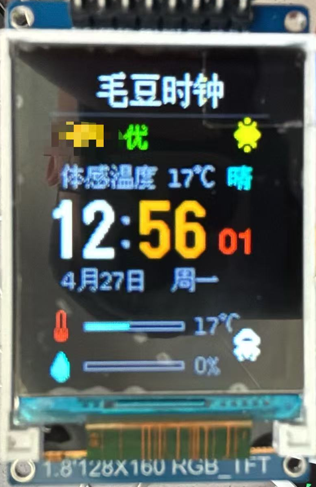
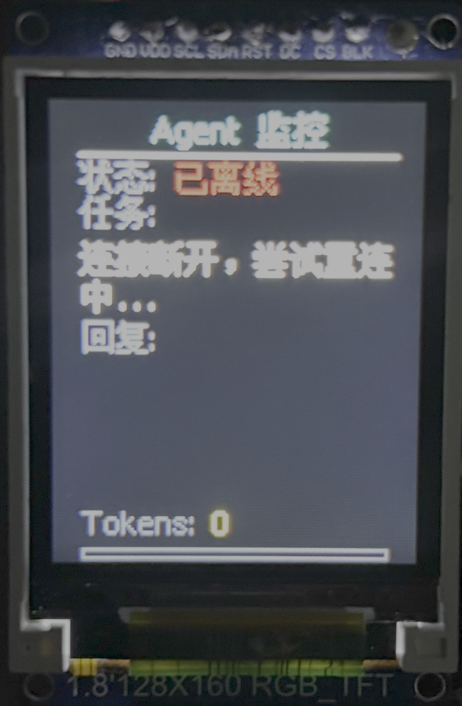

# Maodou Clock & Agent Monitor | 毛豆时钟与 Agent 监控器 🕒☁️🤖

**毛豆时钟 (Maodou Clock)** 是一款基于 **ESP32-C3** 和 **ST7735S 1.8寸 TFT屏幕** 开发的高颜值桌面多功能极客设备。 

它不仅深度还原了 DuduDuck 的高颜值天气时钟，更融入了**智能体 (LLM Agent) 实时监控器**的双重属性。通过物理按键，你可以在“精美太空人天气时钟”与“AI Agent 实时运行看板”两个界面之间秒级无缝切换。

采用 `U8g2` 渲染引擎完美解决中文锯齿问题，并基于底层的 **WebSocket 异步事件驱动** 与 **游戏引擎级局部防闪烁重绘** 技术，打造极度丝滑、零延迟的极客桌面物理看板。

   

<div align="left">
  
  
</div>

---

## 🌟 核心特性

### 1. 🌐 双模式秒级无缝切换
通过物理按键（GPIO 9）触发模式切换。状态机管理前后台，在**精美天气时钟**与 **AI Agent 终端监控**之间来回跳转，切换过程无黑屏、无闪烁。

### 2. 🌤️ 经典太空人天气时钟（模式一）
- **零代码智能配网**：集成 `WiFiManager`，通过手机连接 `Maodou-Clock-Setup` 热点即可在网页端轻松配置 WiFi 密码。
- **抗锯齿视网膜显示**：使用 12px/16px 抗锯齿中文字体，数字与图标左边距像素级对齐。
- **实时气象监测**：定时抓取心知天气 API，显示气温、体感、AQI 污染变色提醒，右下角内置经典太空人两帧走动动画。

### 3. 🤖 AI Agent 实时物理监控（模式二）
- **事件驱动极速通信**：ESP32 作为客户端，与电脑端运行的 Agent 建立 **WebSocket 异步长连接**。不占用 CPU 轮询资源，消息和状态变更达到毫秒级推送。
- **弹性流式排版（Vertical Flow Layout）**：智能计算中英文混排的真实宽度，自动把超长文本折断为多行。更酷的是，如果“任务”内容变短（如只有 1 行），下方的“回复”版块会自动向上吸附贴合，并将多出的空间**自动扩容至最多 5 行显示**！
- **平滑上下逐行滚动**：如果工作任务或 AI 产生的回复字数过多，内容会像提词器一样**每 1.5 秒向上平稳滚动一行**，并在句首句尾贴心停顿 3 秒。
- **零闪屏局部重绘（Zero Flicker）**：应用游戏级局部绘制技术，**只有当某一像素行的文字内容发生真实变化时才会局部擦除重绘**，杜绝了传统 TFT 刷屏时的剧烈闪烁和高频撕裂。
- **多 Agent 兼容**：完美支持 **Hermes Agent**、**OpenClaw (小龙虾)** 等主流自主智能体。

---

## 🛠️ 硬件清单与接线

### 1. 硬件清单
| 模块 | 规格 | 备注 |
| :--- | :--- | :--- |
| **主控** | ESP32-C3 | 推荐 WeAct Studio / SuperMini 尺寸 |
| **屏幕** | 1.8寸 RGB TFT | 驱动 IC: ST7735S, 分辨率: 128x160 |
| **按键** | 轻触按键 | 用于切换模式。直接使用开发板板载的 BOOT 键（GPIO 9）亦可 |

### 2. 硬件接线 (Wiring)

| 屏幕/外设引脚 | ESP32-C3 引脚 | 说明 |
| :--- | :--- | :--- |
| **VCC** | 3.3V | 电源正极 |
| **GND** | GND | 电源地 |
| **SCL (SCK)** | GPIO 4 | SPI 时钟 |
| **SDA (MOSI)** | GPIO 6 | SPI 数据输入 |
| **RES (RST)** | GPIO 3 | 屏幕复位 |
| **DC (A0)** | GPIO 2 | 数据/命令选择 |
| **CS** | GPIO 7 | 片选引脚 |
| **BLK** | 3.3V / GPIO 5 | 背光引脚 (接3.3V常亮，也可指定引脚控制) |
| **物理按键** | **GPIO 9** | 模式切换按键（一端接 GPIO 9，一端接 GND） |

---

## 🚀 软件环境配置 (PlatformIO)

本项目推荐在 **VS Code + PlatformIO** 下进行开发。由于引脚配置不走默认矩阵，MISO 留空等操作在某些核心库中会引发警告。为了解决此问题，代码中已对底层 SPI 及各模块进行了软硬件层面的静默与优化。

### 1. 依赖库 (platformio.ini)
在 `platformio.ini` 中添加以下依赖（特别是新增的 WebSockets 库）：
```ini
lib_deps =
    Adafruit GFX Library
    Adafruit ST7735 and ST7789 Library
    U8g2_for_Adafruit_GFX
    ArduinoJson
    WiFiManager
    links2004/WebSockets @ ^2.4.1
```

### 2. 大程序分区配置
由于集成了中文字库，固件体积较大，必须在 `platformio.ini` 中启用 huge_app 分区：
```ini
board_build.partitions = huge_app.csv
```

---

## 📝 快速开始

### 步骤一：配置 ESP32-C3 固件
1. 克隆本项目并用 PlatformIO 打开。
2. 打开 `src/main.cpp`，修改以下两个配置区：
   * **天气配置**：
     ```cpp
     const String apiKey = "你的心知天气私钥";
     const String location = "shenzhen"; // 城市拼音
     ```
   * **电脑端 Agent 的 WebSocket 连接配置**：
     ```cpp
     // 填写你电脑的真实局域网 IP（绝对不能写 127.0.0.1，且需保证电脑与时钟在同一热点下）
     String agentIP = "172.20.10.4";  
     int agentPort = 9119;
     String wsPath = "/api/agent/status";
     ```
3. 编译并烧录固件到您的 ESP32-C3。

### 步骤二：运行 PC 端伴侣脚本
为了让你的电脑在运行 Agent（Hermes 或小龙虾）时自动把状态推送给时钟，且**避免在单片机上做繁重、耗资源的 Markdown 字符串过滤**，我们采用“轻量边缘端、重负荷后端”的设计。

在运行 Agent 的电脑上运行以下伴侣 Python 脚本。它会实时监控你的会话文件，**过滤掉回复中多余的 `**` 加粗等 Markdown 符号**，并将清洗后的纯净数据推送至时钟：

1. 电脑端安装依赖：
   ```bash
   pip install websockets asyncio
   ```
2. 运行伴侣脚本：
   ```bash
   python agent_companion.py
   ```
   *(该脚本会自动在电脑上开启一个局域网可访问的 `ws://0.0.0.0:9119` 协议端口，并自动定位并追踪最新的 Agent 会话文件)*

---

## 🎨 界面运行状态说明

* **天气时钟模式**：
  * 精准阿里云对时，红色秒针平滑运动。宇航员每 500ms 交互走动一步（动画频率由 `millis()` 独立控制，不受 10ms 极速物理按键扫描环路影响）。
* **Agent 监控模式**：
  * **状态行**：显示 `已连接` (绿色) / `已离线` (红色)。
  * **任务与回复行**：如果任务或回复只有 1 行，界面会自动向上提拉贴合，空出的空间会留给回复展示，最多同时显示 5 行回复！文字超出屏幕时会平滑向上滚动，中英文排版永不截断乱码。
  * **Tokens & 进度条**：Tokens 以淡黄色显示在左下角，最下方是一个极简的橙色进度条指示器。

---

## 🙏 鸣谢 (Credits)

- [U8g2_for_Adafruit_GFX](https://github.com/olikraus/u8g2)
- [WebSockets (Links2004)](https://github.com/Links2004/arduinoWebSockets)
- [WiFiManager](https://github.com/tzapu/WiFiManager)
- [DuduDuck Design Language](https://github.com/DuduDuck)

---
*如果你喜欢这个将硬核 Agent Telemetry 与可爱桌面结合的设计，欢迎点个 ⭐️ Star！*